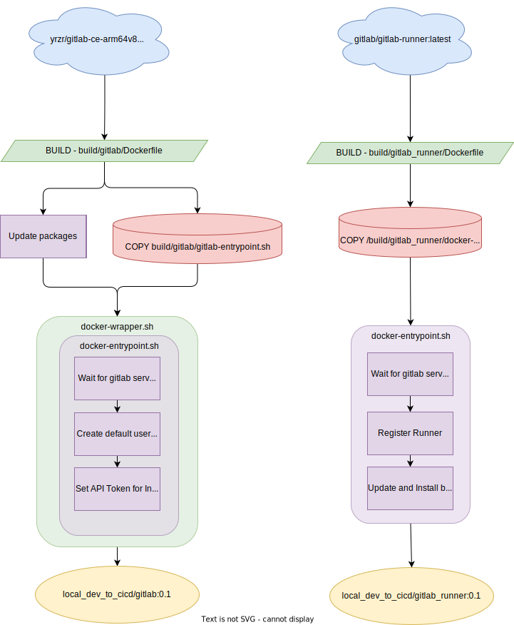
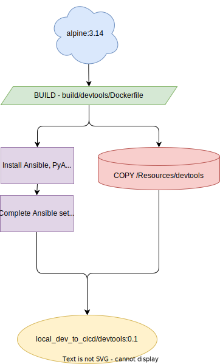

# Introduction to our Project

Don't worry - you are not expecting to come up with a project from the ground up. Instead, we'll be working on a small sample project that you can find in [this](https://github.com/moore-automation/local_dev_to_cicd) repository.

For this first small project, we will take network device configuration as an example of version-controlled files that will be applied to the devices in our environment through our pipeline later.

*Note: In case you're reading this from the future - this repository was created for the purpose of a Partner Interactive Workshop, you can use the code as you like (subject to license) though the lab/topology sections will be redundant. There is some further documentation on how the containers are used below. *

## Prerequisites

To follow this Workshop, you should have these things:

- Docker (covered in previous Hands-On session)
- GitLab Account to save the project in a repo
- VPN Client for connection to dCloud (AnyConnect)

## The Project

In this project, we will work through different approaches of network device configuration and their principles.

In the first section, we will start with the classic manual method of on-device CLI configuration - the good old reliable.
Next, we will progress and examine different tools and processes that will support us - doing these changes for us. Afterwards we will shed the light on the centralized approach using a project in GitLab and start to build the foundation for our fully automated pipeline.

In the second section we will create different stages for our pipeline that will handle different things for us. We will have different environments to deploy our changes to - to test and examine them and their impact.
With all these previous building blocks, you will bring everything together: From centralized files pushed, tested, and deployed through your pipeline into your environment.

## Lab Topology

The below topology details the dCloud instance we'll used as part of this lab:

- Access: Provided via an AnyConnect VPN and will be provided by your breakout proctor.
- Ubuntu VM: Hosts the Automation components.
- Catalyst VM: There are two Cat9K instances which will represent a development and production switch.


## Automation Architecture

For reference we have included a visual workflow of the build process - when you enter ``` docker compose up -d ``` the referenced images are searched locally, if they aren't present, they are built based on what is documented in the compose and associated DOCKERFILE.

- If you are attending our lab session, this repository will be present on the ubuntu VM documented above.
- If you are looking to enhance or extend this repository you can add additional components in a similar way as documented in the workflows below.

We have chosen to ignore docker to build this lab and just install directly to the VM though it's important when you're designing your own stack that you understand how to interact with containers and more importantly why creating a modular system is useful when developing and separating environments. [Why Containers - Cisco](https://www.cisco.com/c/en/us/solutions/cloud/what-are-containers.html#~why-containers)

### Gitlab Components

To get started with Gitlab we have included a single GitLab instance and a runner (used to execute CI tasks.) A default_user and project are created automatically.

- User: default_user
- Password: C1sco12345

Once you've started the containers you can access the  GUI at localhost:2080 or by clicking [here](http://localhost:2080).

The build process is more complicated than some you may have seen - it requires multiple entrypoint scripts and a wrapper to ensure the user and projects are created, as well as successfully registering the runner. As we wanted a single up process each container waits for the GitLab service to be fully up by iteratively checking the health using : ```curl $GITLAB_URL:80/-/health```.

*Git Related Build Process*
\

\

### Devtools Container

\
*DevTools Build Process*


